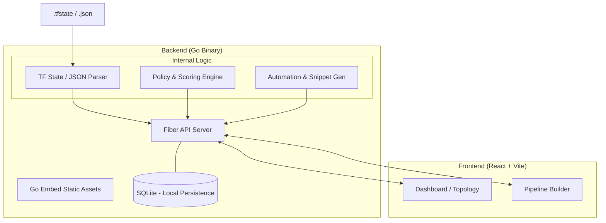

# 🔭 InfraSight

[](https://go.dev/)
[](https://reactjs.org/)
[](https://sqlite.org/)
[](LICENSE)

**InfraSight** is a zero-config, local-first DevOps command center designed for visualizing, governing, and planning multicloud infrastructure automation.

By reading local Terraform `.tfstate` files or mock JSON snapshots, InfraSight normalizes resources into an in-memory topology, enriches them with policy findings, observability signals, cost estimates, and remediation runbooks—all served from a single Go binary.

---

## ✨ Key Features

### 🔍 Visualization & Inventory
- **Multi-Cloud Topology:** Provider-grouped visualization for AWS, Azure, GCP, and more.
- **Searchable Inventory:** Advanced filtering by provider, status, environment, and resource type.
- **Dependency Mapping:** Understand resource relationships and plan changes locally.

### ⚖️ Governance & Cost Control
- **Cost Estimation:** Monthly cost projections derived from a local pricing dictionary.
- **Governance Scoring:** Automated scoring across Security, Reliability, Ownership, and Compliance.
- **Finding Engine:** Detects high-cost instances, public subnets, missing tags, and exposed VMs.

### ⚙️ Automation & Remediation
- **Smart Remediation:** Generates provider-aware actions (Terraform snippets, CLI commands, GitHub Actions, and GitLab CI).
- **Workflow Management:** Lifecycle tracking for actions: `suggested` → `approved` → `queued` → `executed`.
- **Pipeline Builder:** Local UI to build pipelines with triggers, validations, and manual approvals.

---

## 🏗️ Architecture

InfraSight is built for portability, embedding a React frontend into a high-performance Go backend.



---

## 🚀 Getting Started

### Prerequisites
- **Go** 1.25+
- **Node.js** & **npm**
- *No cloud credentials or external databases required.*

### 1. Build the Frontend
Vite outputs the build directly to `backend/dist`, which is then embedded into the Go binary.
```powershell
cd web
npm install
npm run build
cd ..
```

### 2. Run the Backend
```powershell
cd backend
go run .
```
> **Access the dashboard:** [http://localhost:8080](http://localhost:8080)

### 3. Run with Custom Data
To load a specific state file or mock snapshot:
```powershell
cd backend
$env:INFRA_STATE_FILE = "..\examples\mock-multicloud.json"
go run .
```

### 4. Build Single Executable
```powershell
cd web && npm run build && cd ..
cd backend
go build -buildvcs=false -o infrasight.exe .
```

---

## ⚙️ Configuration

Control InfraSight behavior using environment variables:

| Variable | Description | Default |
| :--- | :--- | :--- |
| `PORT` | HTTP server port | `8080` |
| `INFRA_STATE_FILE` | Path to Terraform `.tfstate` or JSON snapshot | `None` |
| `INFRASIGHT_DB` | Path to the SQLite persistence file | `backend/infrasight.db` |
| `GOCACHE` | Custom Go cache path (useful for restricted environments) | `Standard Go Cache` |

---

## 🔌 API Reference

### Core & Metadata
- `GET /api/health` - System health status.
- `GET /api/snapshot` - Current infrastructure topology.
- `GET /api/export` - Export state as JSON.
- `POST /api/validate` - Validate a local snapshot.

### Governance & Cost
- `GET /api/pricing` - Local pricing dictionary data.
- `GET /api/policies` - Active governance rules.
- `GET /api/score` - Global governance scorecard.
- `GET /api/report.md` - Generate a Markdown governance report.

### Automation
- `GET /api/actions` - List all remediation actions.
- `PATCH /api/actions/:id/state` - Transition action state (e.g., to `approved`).
- `GET /api/plans` - List pipeline plans.
- `POST /api/runbooks` - Create custom remediation runbooks.

---

## 🔄 DevOps Workflow

1.  **Import:** Load your local `.tfstate` or mock JSON file.
2.  **Analyze:** Review the topology and identify cost spikes or security risks.
3.  **Inspect:** Use the Governance tab to find resources with missing owners or public exposure.
4.  **Remediate:** Select a finding, review the generated Terraform or CLI snippet, and mark it as `Approved`.
5.  **Plan:** Build a pipeline sequence for the approved changes.
6.  **Export:** Download the updated plan or a full Markdown report for stakeholders.

---

## 🛠️ Development & Troubleshooting

### Development Commands
- **Frontend Linting:** `cd web && npm run lint`
- **Backend Testing:** `cd backend && go test ./...`

### Troubleshooting Common Issues

**VCS Stamping Error:**
If `go build` fails due to git info, use:
```bash
go build -buildvcs=false -o infrasight.exe .
```

**Permission Issues (Windows):**
If Go cannot write to the default cache, set a local cache:
```powershell
$env:GOCACHE = (Join-Path (Get-Location) ".gocache")
```

**Stale UI:**
If the dashboard doesn't reflect changes, ensure you've rebuilt the frontend assets:
```bash
cd web && npm run build
```

---

## 📝 Notes
- **Local-First:** All data remains on your machine. InfraSight does **not** communicate with AWS, Azure, or GCP APIs.
- **Dry-Run Scaffolds:** Automation snippets are for review and should be verified before manual execution in production environments.
- **Storage:** SQLite is used exclusively for persisting local plans and action states.

---
*Developed as a local-first alternative for cloud infrastructure governance.*
