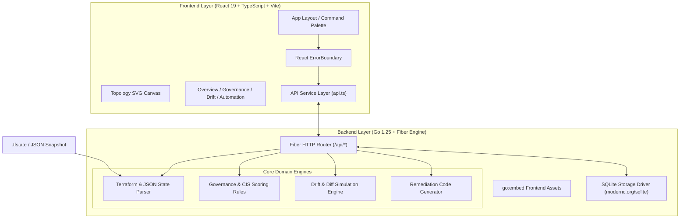

# 🔭 InfraSight — DevOps Local-First Command Center

[](https://go.dev/)
[](https://reactjs.org/)
[](https://www.typescriptlang.org/)
[](https://sqlite.org/)
[](LICENSE)

**InfraSight** is a zero-configuration, local-first DevOps command center built for multi-cloud infrastructure governance, interactive dependency topology visualization, cost optimization, and dry-run remediation planning.

By ingesting local Terraform `.tfstate` files or normalized JSON snapshots, InfraSight unifies resources across **AWS, Azure, GCP, and custom providers** into an interactive topology canvas, calculates governance scores, projects monthly spend, and scaffolds non-destructive remediation runbooks—all packaged into a single portable Go binary.

---

## 📐 Key Technical Decisions & Architectural Rationale

### 1. Single Portable Executable via `go:embed`
* **Decision:** Embed compiled Vite single-page application (SPA) static assets (`../backend/dist`) into the Go binary at compile-time using Go standard library `embed.FS`.
* **Rationale:** Eliminates deployment complexity, external web server dependencies (Nginx/Apache), and CORS issues. Infrastructure engineers can distribute a single executable binary (`infrasight.exe`) across air-gapped or restricted environments.

### 2. Local-First & Zero Cloud Credentials
* **Decision:** Perform all parsing, topology rendering, scoring, and dry-run code generation strictly on the user's machine without making outbound network requests to AWS, GCP, or Azure APIs.
* **Rationale:** Maximum security compliance. Avoids requiring high-privilege cloud IAM credentials or secret access keys, preventing accidental production resource mutations or data exfiltration.

### 3. Resilient Fallback Storage Architecture
* **Decision:** Primary persistence is handled via SQLite (`modernc.org/sqlite` pure-Go CGO-free driver). If SQLite cannot initialize (e.g. read-only filesystem or restricted permissions), backend handlers gracefully degrade to in-memory fallback state.
* **Rationale:** Guarantees zero-downtime execution and instant usability out-of-the-box on any workstation, container, or CI/CD environment without requiring local file lock permissions.

### 4. Interactive SVG Canvas & Topology Math
* **Decision:** Build a custom SVG-based layout renderer supporting smooth drag-and-drop node positioning, provider grouping, radial layout auto-arrangement, blast-radius isolation, and SVG/PNG vector exports.
* **Rationale:** Avoids heavyweight canvas dependencies and WebGL memory leaks, ensuring lightweight performance across large multicloud state files.

### 5. Unified API Service Layer & React Error Boundary
* **Decision:** Centralize HTTP communication in `src/services/api.ts` with typed fallback handlers, wrapped by a top-level React `ErrorBoundary`.
* **Rationale:** Prevents transient network or serialization errors from crashing the UI, providing explicit error notifications and retry capabilities.

---

## 🏗️ System Architecture



---

## ✨ Features Breakdown

| Module | Features & Capabilities |
| :--- | :--- |
| 🔍 **Topology Canvas** | Provider grouping (AWS/GCP/Azure), radial layouts, zoom/pan controls, draft edge previews, blast-radius highlights, SVG/PNG export. |
| 📦 **Searchable Inventory** | Multi-attribute text filtering, provider badges, environment tagging, ownership tracking, cost sorting. |
| 🛡️ **Governance & Scorecard** | Automated CIS compliance, Well-Architected & FinOps category scores, risk severity findings. |
| 📊 **Observability Correlation** | Integrated telemetry signals (CPU, error rate, throughput, monthly cost), alarm status, incident logs, SLO burn rates. |
| 🔄 **Drift Detection** | Diff tracking between state snapshots and desired topology with simulated `terraform plan` execution snippets. |
| ⚡ **Automation Toolkit** | Drag-and-drop pipeline builder, dry-run remediation Snippets (Terraform, CLI, GitHub Actions, GitLab CI), approval lifecycle tracking. |

---

## 🚀 Quick Start Guide

### Prerequisites
* **Go** 1.25+
* **Node.js** (v18+) & **npm**

### 1. Build Frontend Assets
```powershell
cd web
npm install
npm run build
cd ..
```

### 2. Run Go Backend Server
```powershell
cd backend
go run .
```
> Access interface in browser at: `http://localhost:8080`

### 3. Load Custom State or Snapshot File
```powershell
cd backend
$env:INFRA_STATE_FILE = "..\examples\mock-multicloud.json"
go run .
```

### 4. Build Standalone Production Executable
```powershell
cd web && npm run build && cd ..
cd backend
go build -buildvcs=false -o infrasight.exe .
```

---

## 🔌 API Reference Summary

| Endpoint | Method | Description |
| :--- | :--- | :--- |
| `/api/health` | `GET` | System health check and API version info. |
| `/api/snapshot` | `GET` | Current normalized infrastructure topology & findings. |
| `/api/export` | `GET` | Export full normalized snapshot as JSON download. |
| `/api/validate` | `POST` | Validate custom snapshot JSON payload. |
| `/api/pricing` | `GET` | Retrieve local cloud pricing dictionary. |
| `/api/policies` | `GET` / `POST` | List active governance rules or register custom policies. |
| `/api/score` | `GET` | Calculate current governance category scorecard. |
| `/api/report.md` | `GET` | Download stakeholder Markdown governance report. |
| `/api/actions` | `GET` / `POST` | List or register remediation automation actions. |
| `/api/actions/:id/state` | `PATCH` | Transition action lifecycle state (`suggested` → `approved` → `queued` → `executed`). |
| `/api/plans` | `GET` / `POST` | Retrieve or save pipeline builder plans. |
| `/api/runbooks` | `GET` / `POST` | Query or add remediation runbook playbooks. |

---

## 🛣️ Future Roadmap & Recommended Enhancements

- [ ] **OPA / Rego Policy Integration:** Support native Open Policy Agent (.rego) policy evaluation for advanced custom enterprise compliance rules.
- [ ] **Real-time HCL Parser:** Native HCL file parsing directly from local `.tf` directories (in addition to `.tfstate`).
- [ ] **Mermaid & D2 Export:** Generate native Mermaid.js and D2 diagram syntax from topology selections.
- [ ] **TypeScript Component Migration:** Complete transition of remaining `.jsx` components in `web/src/components` and `web/src/views` to fully typed `.tsx` modules.

---

## 📝 License
Distributed under the **MIT License**. See `LICENSE` for details.
